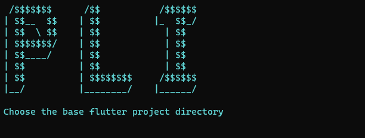

# generateApkFromAppBundle
A *CLI* with a Python script for building **appbundle** and generating **apk**s from it.
Or, as I prefer, a PLI, *Python Line InterFace*.



## How to use it 🎯:
* Make sure you have installed Python and Java
* Clone the repository
* Download the [latest version of bundleTool.jar](https://github.com/google/bundletool/releases)
* Move the bundletool-all-x.x.x to the directory which you clone the repository
* Rename the bundletool-all-x.x.x to bundletool.jar
* Add the location of bin folder to PATH
* Run:

Command line
```
    generate_apk
```

## Why 💡:
In cases where both appbundle and apk are desired, this PLI may be useful.

Or even when, for some reason like mine, the apk **APK** can't be directly generated from **flutter build apk**.

## Improvements or Suggestions 🚀:
* Create requirements
* Add an optional parameter to run on the current location
* Make a script to download the bundletool
* Make cross platform (installation and running)

## ASCII ART generator:
https://patorjk.com/software/taag
